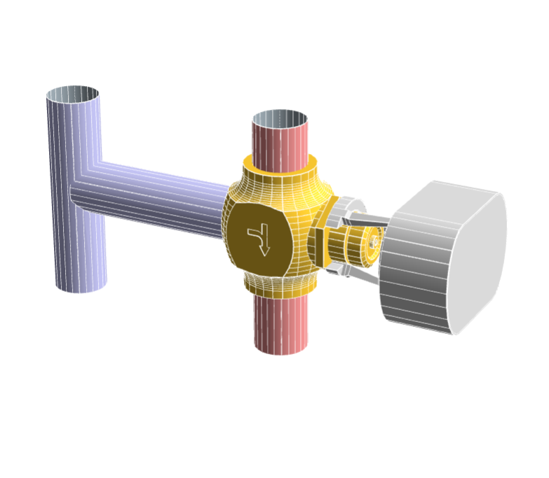
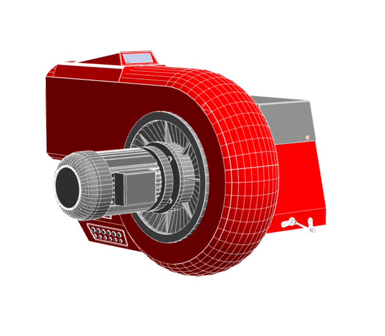

    

      
En route vers l'internet de l'énergie

      
Dans le monde du numérique, peu de startups se penchent sur l’expérience ressentie par les agents de terrain,
        qui font des actions mécaniques, dans le cambouis toute la journée, au fond des salles des machines et des chaufferies.

      
Pourtant, s'il y a bien une population pour qui l'exploitation de la donnée peut s'avérer fondamentale, c'est bien celle là.
        Pourquoi toujours focaliser sur les personnels de bureau qui remplissent des tableaux à n'en plus finir,
        envoyant des mels en continu et qui vont finir par prendre en grippe le software en général.

      
OBM veut créer une plateforme tech qui changerait le quotidien des agents de terrain, en remplaçant intégralement
        le modèle productiviste du passé par un modèle centré client.

      
C'est pourquoi nous faisons le choix de nous intéresser de près au hardware et aux actionneurs, alors que la concurrence
         se limite à travailler sur l'interopérabilité entre les marques, confortablement confinée dans un univers virtuel.

      
Nous ne voulons pas d'un nouveau produit se rajoutant verticalement aux logiciels existants mais changer de paradigme pour révolutionner les métiers de la maintenance.

    

    

       

         <ol class="carousel-indicators">
           <li data-target="#CarAction" data-slide-to="0" class="active"></li>
           <li data-target="#CarAction" data-slide-to="1"></li>
           <li data-target="#CarAction" data-slide-to="2"></li>
           <li data-target="#CarAction" data-slide-to="3"></li>
         </ol>
         

           

             
             

               <h5>servomoteur</h5>
             

           

           

             
             

               <h5>circulateur / pompe</h5>
             

           

           

             
             

               <h5>vanne 3 voies</h5>
             

           

           

             
             

               <h5>bruleur gaz</h5>
             

           

         

       

    

